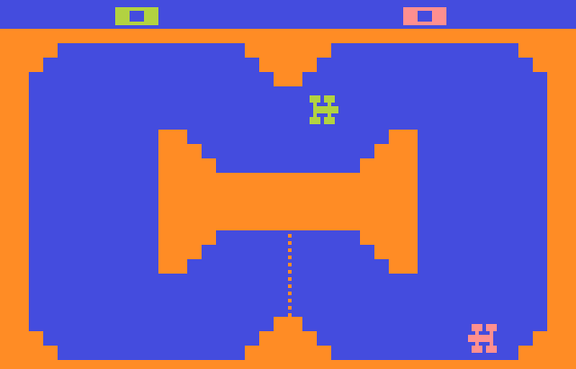

Welcome to 70`s CAR SIMULATOR !
=============================

In memory of the 1976 Indy 500, when Steve Jobs still worked with Steve Wozniak for Atari. This is a tribute to them.

Walk into any arcade in the late 70s and early 80s, and you were sure to find one of the Sprint racing games. Even though the graphics were simple, the action was intense and drifting around the tracks alone or with a friend was always a blast.

Control Keys:
-----------------

**Arrow UP** 
**Arrow DOWN** 
**Arrow RIGHT** 
**Arrow LEFT** 

The game starts by pressing the **START** key and after the start sound, you have 1 minute to make as many laps as you can. Each turn is 15 points and very careful to hit the walls, you will explode and you only have 3 lives. 

If you want to play again press the **RESET** key.

Good luck and enjoy...

